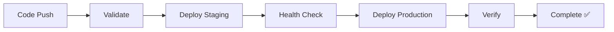

# 🔍 TextLens - AI-Powered OCR

[](https://huggingface.co/spaces/GoConqurer/textlens-ocr)
[](https://github.com/KumarAmrit30/textlens-ocr)
[](https://www.python.org/downloads/)

A state-of-the-art Vision-Language Model (VLM) based OCR application that extracts text from images using Microsoft Florence-2 with intelligent fallback systems and enterprise-grade zero downtime deployment.

## 🚀 Live Demo

**🔗 Try it now:** [https://huggingface.co/spaces/GoConqurer/textlens-ocr](https://huggingface.co/spaces/GoConqurer/textlens-ocr)


## ✨ Key Features

### 🤖 Advanced AI-Powered OCR

- **Microsoft Florence-2 VLM**: State-of-the-art vision-language model for text extraction
- **Intelligent Fallback System**: Automatic fallback to EasyOCR if primary model fails
- **Multi-Model Support**: Florence-2-base and Florence-2-large variants
- **Real-time Processing**: Instant text extraction on image upload

### 🎨 Modern User Experience

- **Clean UI**: Professional Gradio interface with intuitive design
- **Multiple Input Methods**: Upload files, use webcam, or paste from clipboard
- **Copy-to-Clipboard**: One-click text copying functionality
- **Responsive Design**: Works seamlessly on desktop and mobile devices
- **Dark/Light Theme**: Automatic theme adaptation

### ⚡ Performance & Reliability

- **GPU Acceleration**: Supports CUDA, MPS (Apple Silicon), and CPU inference
- **Smart Device Detection**: Automatically uses best available hardware
- **Error Resilience**: Robust error handling with graceful degradation
- **Memory Optimization**: Efficient model loading and cleanup

### 🛡️ Enterprise Features

- **Zero Downtime Deployment**: Blue-green deployment with health checks
- **Health Monitoring**: Built-in `/health` and `/ready` endpoints
- **Graceful Shutdown**: Signal handling for clean application restarts
- **Production Ready**: Scalable architecture with automated deployment


## 🚀 Quick Start

### 🌐 Online (Recommended)

**Instant access** - No installation required:
👉 [**Launch TextLens**](https://huggingface.co/spaces/GoConqurer/textlens-ocr)

### 💻 Local Development

1. **Clone Repository**

   ```bash
   git clone https://github.com/KumarAmrit30/textlens-ocr.git
   cd textlens-ocr
   ```

2. **Setup Environment**

   ```bash
   python -m venv textlens_env
   source textlens_env/bin/activate  # Windows: textlens_env\Scripts\activate
   pip install -r requirements.txt
   ```

3. **Launch Application**
   ```bash
   python app.py
   ```
   🌐 Open: `http://localhost:7860`

### 🧪 Quick Test

```bash
# Verify installation
python -c "from models.ocr_processor import OCRProcessor; print('✅ TextLens ready!')"
```

## 📊 Model Performance

| Model                | Size  | Speed     | Accuracy     | Best For               |
| -------------------- | ----- | --------- | ------------ | ---------------------- |
| **Florence-2-base**  | 270M  | ⚡ Fast   | 📈 High      | General OCR, Real-time |
| **Florence-2-large** | 770M  | 🐌 Medium | 📊 Very High | High accuracy needs    |
| **EasyOCR**          | ~100M | 🚀 Medium | 📋 Good      | Fallback, Multilingual |

## 🎯 Supported Use Cases

| Category            | Examples                        | Performance |
| ------------------- | ------------------------------- | ----------- |
| 📄 **Documents**    | PDFs, Scanned papers, Forms     | ⭐⭐⭐⭐⭐  |
| 🧾 **Receipts**     | Shopping receipts, Invoices     | ⭐⭐⭐⭐    |
| 📱 **Screenshots**  | App interfaces, Error messages  | ⭐⭐⭐⭐⭐  |
| 🚗 **Vehicle**      | License plates, VIN numbers     | ⭐⭐⭐⭐    |
| 📚 **Books**        | Printed text, Handwritten notes | ⭐⭐⭐⭐    |
| 🌐 **Multilingual** | Multiple languages              | ⭐⭐⭐      |

## 🔧 Configuration

### 🎛️ Model Selection

```python
from models.ocr_processor import OCRProcessor

# Fast inference (recommended)
ocr = OCRProcessor(model_name="microsoft/Florence-2-base")

# Maximum accuracy
ocr = OCRProcessor(model_name="microsoft/Florence-2-large")
```

### 🎨 UI Customization

Modify `ui/styles.py` to customize appearance:

```python
# Change color scheme
PRIMARY_COLOR = "#1f77b4"
SECONDARY_COLOR = "#ff7f0e"

# Update layout
INTERFACE_WIDTH = "100%"
```

### ⚙️ Environment Variables

| Variable               | Description          | Default                |
| ---------------------- | -------------------- | ---------------------- |
| `SPACE_ID`             | HuggingFace Space ID | Auto-detected          |
| `DEPLOYMENT_STAGE`     | deployment stage     | `production`           |
| `TRANSFORMERS_CACHE`   | Model cache path     | `~/.cache/huggingface` |
| `CUDA_VISIBLE_DEVICES` | GPU selection        | All available          |


**Deployment Flow:**



## 🤝 Contributing

We welcome contributions! Here's how to get started:

### 🔧 Development Setup

1. **Fork & Clone**

   ```bash
   git clone https://github.com/YOUR_USERNAME/textlens-ocr.git
   cd textlens-ocr
   ```

2. **Create Branch**

   ```bash
   git checkout -b feature/your-feature-name
   ```

3. **Make Changes**

   - Add new features or fix bugs
   - Update tests and documentation
   - Follow code style guidelines

4. **Test Changes**

   ```bash
   python -m pytest tests/
   python -c "from models.ocr_processor import OCRProcessor; OCRProcessor()"
   ```

5. **Submit PR**
   ```bash
   git add .
   git commit -m "feat: add your feature description"
   git push origin feature/your-feature-name
   ```

### 📝 Contribution Guidelines

- **Code Style**: Follow PEP 8, use Black formatter
- **Documentation**: Update README and docstrings
- **Tests**: Add tests for new functionality
- **Commits**: Use conventional commit messages
- **Issues**: Link PRs to relevant issues

## 📄 License

This project is licensed under the **MIT License** - see the [LICENSE](LICENSE) file for details.

### 🙏 Third-Party Licenses

- **Microsoft Florence-2**: [MIT License](https://github.com/microsoft/Florence)
- **HuggingFace Transformers**: [Apache License 2.0](https://github.com/huggingface/transformers)
- **Gradio**: [Apache License 2.0](https://github.com/gradio-app/gradio)
- **EasyOCR**: [Apache License 2.0](https://github.com/JaidedAI/EasyOCR)

## 🌟 Acknowledgments

Special thanks to:

- **Microsoft Research** for the incredible Florence-2 vision-language model
- **HuggingFace** for the transformers library and Spaces platform
- **Gradio Team** for the amazing web interface framework
- **JaidedAI** for EasyOCR fallback capabilities
- **Open Source Community** for continuous support and contributions

## 📈 Project Status

| Component         | Status        | Version |
| ----------------- | ------------- | ------- |
| **Core OCR**      | ✅ Stable     | v1.0.0  |
| **Web UI**        | ✅ Stable     | v1.0.0  |
| **Deployment**    | ✅ Production | v1.0.0  |
| **API**           | ✅ Stable     | v1.0.0  |
| **Documentation** | ✅ Complete   | v1.0.0  |

### 📊 Stats


---

<div align="center">

**Made with ❤️ for the AI community**

[⭐ Star this repo](https://github.com/KumarAmrit30/textlens-ocr) • [🔗 Try the demo](https://huggingface.co/spaces/GoConqurer/textlens-ocr) • [📖 Read docs](DEPLOYMENT.md)

</div>
