# 🔍 TextLens - AI-Powered OCR

[](https://huggingface.co/spaces/GoConqurer/textlens-ocr)
[](https://github.com/KumarAmrit30/textlens-ocr)
[](LICENSE)
[](https://www.python.org/downloads/)

A state-of-the-art Vision-Language Model (VLM) based OCR application that extracts text from images using Microsoft Florence-2 with intelligent fallback systems and enterprise-grade zero downtime deployment.

## 🚀 Live Demo

**🔗 Try it now:** [https://huggingface.co/spaces/GoConqurer/textlens-ocr](https://huggingface.co/spaces/GoConqurer/textlens-ocr)


## ✨ Key Features

### 🤖 Advanced AI-Powered OCR

- **Microsoft Florence-2 VLM**: State-of-the-art vision-language model for text extraction
- **Intelligent Fallback System**: Automatic fallback to EasyOCR if primary model fails
- **Multi-Model Support**: Florence-2-base and Florence-2-large variants
- **Real-time Processing**: Instant text extraction on image upload

### 🎨 Modern User Experience

- **Clean UI**: Professional Gradio interface with intuitive design
- **Multiple Input Methods**: Upload files, use webcam, or paste from clipboard
- **Copy-to-Clipboard**: One-click text copying functionality
- **Responsive Design**: Works seamlessly on desktop and mobile devices
- **Dark/Light Theme**: Automatic theme adaptation

### ⚡ Performance & Reliability

- **GPU Acceleration**: Supports CUDA, MPS (Apple Silicon), and CPU inference
- **Smart Device Detection**: Automatically uses best available hardware
- **Error Resilience**: Robust error handling with graceful degradation
- **Memory Optimization**: Efficient model loading and cleanup

### 🛡️ Enterprise Features

- **Zero Downtime Deployment**: Blue-green deployment with health checks
- **Health Monitoring**: Built-in `/health` and `/ready` endpoints
- **Graceful Shutdown**: Signal handling for clean application restarts
- **Production Ready**: Scalable architecture with automated deployment

## 🏗️ Architecture

```
textlens-ocr/
├── 📱 Frontend (Gradio UI)
│   ├── ui/interface.py      # Main interface components
│   ├── ui/handlers.py       # Event handlers & logic
│   └── ui/styles.py         # CSS styling & themes
├── 🧠 AI Models
│   └── models/ocr_processor.py  # OCR engine with fallbacks
├── 🔧 Utilities
│   └── utils/image_utils.py     # Image preprocessing
├── 🚀 Deployment
│   ├── .github/workflows/       # CI/CD pipelines
│   ├── scripts/deploy.py        # Manual deployment tools
│   └── deployment.config.yml    # Deployment configuration
├── 📚 Documentation
│   ├── README.md               # Main documentation
│   └── DEPLOYMENT.md           # Deployment guide
└── ⚙️ Configuration
    ├── app.py                  # Main application entry
    └── requirements.txt        # Dependencies
```

## 🚀 Quick Start

### 🌐 Online (Recommended)

**Instant access** - No installation required:
👉 [**Launch TextLens**](https://huggingface.co/spaces/GoConqurer/textlens-ocr)

### 💻 Local Development

1. **Clone Repository**

   ```bash
   git clone https://github.com/KumarAmrit30/textlens-ocr.git
   cd textlens-ocr
   ```

2. **Setup Environment**

   ```bash
   python -m venv textlens_env
   source textlens_env/bin/activate  # Windows: textlens_env\Scripts\activate
   pip install -r requirements.txt
   ```

3. **Launch Application**
   ```bash
   python app.py
   ```
   🌐 Open: `http://localhost:7860`

### 🧪 Quick Test

```bash
# Verify installation
python -c "from models.ocr_processor import OCRProcessor; print('✅ TextLens ready!')"
```

## 📊 Model Performance

| Model                | Size  | Speed     | Accuracy     | Best For               |
| -------------------- | ----- | --------- | ------------ | ---------------------- |
| **Florence-2-base**  | 270M  | ⚡ Fast   | 📈 High      | General OCR, Real-time |
| **Florence-2-large** | 770M  | 🐌 Medium | 📊 Very High | High accuracy needs    |
| **EasyOCR**          | ~100M | 🚀 Medium | 📋 Good      | Fallback, Multilingual |

## 🎯 Supported Use Cases

| Category            | Examples                        | Performance |
| ------------------- | ------------------------------- | ----------- |
| 📄 **Documents**    | PDFs, Scanned papers, Forms     | ⭐⭐⭐⭐⭐  |
| 🧾 **Receipts**     | Shopping receipts, Invoices     | ⭐⭐⭐⭐    |
| 📱 **Screenshots**  | App interfaces, Error messages  | ⭐⭐⭐⭐⭐  |
| 🚗 **Vehicle**      | License plates, VIN numbers     | ⭐⭐⭐⭐    |
| 📚 **Books**        | Printed text, Handwritten notes | ⭐⭐⭐⭐    |
| 🌐 **Multilingual** | Multiple languages              | ⭐⭐⭐      |

## 🔧 Configuration

### 🎛️ Model Selection

```python
from models.ocr_processor import OCRProcessor

# Fast inference (recommended)
ocr = OCRProcessor(model_name="microsoft/Florence-2-base")

# Maximum accuracy
ocr = OCRProcessor(model_name="microsoft/Florence-2-large")
```

### 🎨 UI Customization

Modify `ui/styles.py` to customize appearance:

```python
# Change color scheme
PRIMARY_COLOR = "#1f77b4"
SECONDARY_COLOR = "#ff7f0e"

# Update layout
INTERFACE_WIDTH = "100%"
```

### ⚙️ Environment Variables

| Variable               | Description          | Default                |
| ---------------------- | -------------------- | ---------------------- |
| `SPACE_ID`             | HuggingFace Space ID | Auto-detected          |
| `DEPLOYMENT_STAGE`     | deployment stage     | `production`           |
| `TRANSFORMERS_CACHE`   | Model cache path     | `~/.cache/huggingface` |
| `CUDA_VISIBLE_DEVICES` | GPU selection        | All available          |

## 🚀 Deployment

### 🤗 HuggingFace Spaces (Recommended)

**Automatic Deployment:**

1. Fork this repository
2. Push to `main`/`master` branch
3. GitHub Actions automatically deploys to HuggingFace Spaces
4. Access your deployed app at: `https://huggingface.co/spaces/USERNAME/textlens-ocr`

**Manual Deployment:**

1. Go to [GitHub Actions](https://github.com/KumarAmrit30/textlens-ocr/actions)
2. Select "Deploy to HuggingFace Spaces"
3. Click "Run workflow"
4. Choose deployment type:
   - **Direct**: Quick deployment to production
   - **Blue-Green**: Zero downtime with staging validation

### 🔄 Zero Downtime Deployment

Our enterprise-grade deployment system ensures **zero downtime** for users:

**Features:**

- 🔵 **Blue-Green Deployment**: Test in staging before production
- 🏥 **Health Monitoring**: Automatic health checks with retry logic
- 🔄 **Graceful Shutdown**: Clean application restarts
- 📊 **Real-time Monitoring**: Deployment status tracking

**Health Endpoints:**

- `GET /health` - Application health status
- `GET /ready` - Application readiness check

**Deployment Flow:**

```mermaid
graph LR
    A[Code Push] --> B[Validate]
    B --> C[Deploy Staging]
    C --> D[Health Check]
    D --> E[Deploy Production]
    E --> F[Verify]
    F --> G[Complete ✅]
```



### 🐳 Docker Deployment

```dockerfile
FROM python:3.9-slim

WORKDIR /app
COPY requirements.txt .
RUN pip install -r requirements.txt

COPY . .
EXPOSE 7860

CMD ["python", "app.py"]
```

Build and run:

```bash
docker build -t textlens-ocr .
docker run -p 7860:7860 textlens-ocr
```

### ☁️ Cloud Platforms

| Platform               | Status        | Guide                                                               |
| ---------------------- | ------------- | ------------------------------------------------------------------- |
| **HuggingFace Spaces** | ✅ Ready      | [Deploy Now](https://huggingface.co/spaces/GoConqurer/textlens-ocr) |
| **Google Colab**       | ✅ Compatible | Open in Colab                                                       |
| **AWS/GCP/Azure**      | 🔧 Docker     | Use Docker deployment                                               |
| **Heroku**             | ⚠️ Limited    | GPU not available                                                   |

## 🧪 Testing & Development

### 🔍 Running Tests

```bash
# Basic functionality test
python -c "
from models.ocr_processor import OCRProcessor
ocr = OCRProcessor()
print(f'✅ Model loaded: {ocr.get_model_info()}')
"

# Test with sample image
python -c "
from PIL import Image
from models.ocr_processor import OCRProcessor
import requests

# Download test image
img_url = 'https://via.placeholder.com/300x100/000000/FFFFFF?text=Hello+World'
image = Image.open(requests.get(img_url, stream=True).raw)

# Test OCR
ocr = OCRProcessor()
result = ocr.extract_text(image)
print(f'✅ OCR Result: {result}')
"
```

### 🛠️ Development Tools

```bash
# Install development dependencies
pip install -r requirements.txt

# Format code
black . --line-length 88

# Type checking
mypy models/ utils/ ui/

# Lint code
flake8 --max-line-length 88
```

## 📚 API Reference

### OCRProcessor Class

```python
from models.ocr_processor import OCRProcessor

# Initialize processor
ocr = OCRProcessor(
    model_name="microsoft/Florence-2-base",  # Model selection
    device=None,                             # Auto-detect device
    torch_dtype=None                         # Auto-select dtype
)

# Extract text from image
text = ocr.extract_text(image)
# Returns: str

# Extract text with bounding boxes
result = ocr.extract_text_with_regions(image)
# Returns: dict with text and regions

# Get model information
info = ocr.get_model_info()
# Returns: dict with model details

# Cleanup resources
ocr.cleanup()
```

### Health Check API

```bash
# Check application health
curl https://huggingface.co/spaces/GoConqurer/textlens-ocr/health

# Response:
{
  "status": "healthy",
  "timestamp": 1640995200,
  "version": "1.0.0",
  "environment": "production"
}

# Check readiness
curl https://huggingface.co/spaces/GoConqurer/textlens-ocr/ready

# Response:
{
  "status": "ready",
  "timestamp": 1640995200
}
```

## 🚨 Troubleshooting

### Common Issues

| Issue                   | Symptoms                 | Solution                                |
| ----------------------- | ------------------------ | --------------------------------------- |
| **Model Loading Error** | ImportError, CUDA errors | Check GPU drivers, install CUDA toolkit |
| **Memory Error**        | Out of memory            | Reduce batch size, use CPU inference    |
| **SSL Certificate**     | SSL errors on macOS      | Run certificate update command          |
| **Permission Error**    | File access denied       | Check file permissions, run as admin    |

### Debug Commands

```bash
# Check CUDA availability
python -c "import torch; print(f'CUDA: {torch.cuda.is_available()}')"

# Check transformers version
python -c "import transformers; print(f'Transformers: {transformers.__version__}')"

# Test health endpoint locally
curl http://localhost:7860/health

# View application logs
tail -f textlens.log
```

### Getting Help

1. 📋 **Check existing issues**: [GitHub Issues](https://github.com/KumarAmrit30/textlens-ocr/issues)
2. 🆕 **Create new issue**: Provide error details and environment info
3. 💬 **Join discussion**: [GitHub Discussions](https://github.com/KumarAmrit30/textlens-ocr/discussions)
4. 📧 **Contact**: Create an issue for direct support

## 🤝 Contributing

We welcome contributions! Here's how to get started:

### 🔧 Development Setup

1. **Fork & Clone**

   ```bash
   git clone https://github.com/YOUR_USERNAME/textlens-ocr.git
   cd textlens-ocr
   ```

2. **Create Branch**

   ```bash
   git checkout -b feature/your-feature-name
   ```

3. **Make Changes**

   - Add new features or fix bugs
   - Update tests and documentation
   - Follow code style guidelines

4. **Test Changes**

   ```bash
   python -m pytest tests/
   python -c "from models.ocr_processor import OCRProcessor; OCRProcessor()"
   ```

5. **Submit PR**
   ```bash
   git add .
   git commit -m "feat: add your feature description"
   git push origin feature/your-feature-name
   ```

### 📝 Contribution Guidelines

- **Code Style**: Follow PEP 8, use Black formatter
- **Documentation**: Update README and docstrings
- **Tests**: Add tests for new functionality
- **Commits**: Use conventional commit messages
- **Issues**: Link PRs to relevant issues

## 📄 License

This project is licensed under the **MIT License** - see the [LICENSE](LICENSE) file for details.

### 🙏 Third-Party Licenses

- **Microsoft Florence-2**: [MIT License](https://github.com/microsoft/Florence)
- **HuggingFace Transformers**: [Apache License 2.0](https://github.com/huggingface/transformers)
- **Gradio**: [Apache License 2.0](https://github.com/gradio-app/gradio)
- **EasyOCR**: [Apache License 2.0](https://github.com/JaidedAI/EasyOCR)

## 🌟 Acknowledgments

Special thanks to:

- **Microsoft Research** for the incredible Florence-2 vision-language model
- **HuggingFace** for the transformers library and Spaces platform
- **Gradio Team** for the amazing web interface framework
- **JaidedAI** for EasyOCR fallback capabilities
- **Open Source Community** for continuous support and contributions

## 📈 Project Status

| Component         | Status        | Version |
| ----------------- | ------------- | ------- |
| **Core OCR**      | ✅ Stable     | v1.0.0  |
| **Web UI**        | ✅ Stable     | v1.0.0  |
| **Deployment**    | ✅ Production | v1.0.0  |
| **API**           | ✅ Stable     | v1.0.0  |
| **Documentation** | ✅ Complete   | v1.0.0  |

### 🎯 Roadmap

- [ ] **Multi-language UI** support
- [ ] **Batch processing** for multiple images
- [ ] **API rate limiting** and authentication
- [ ] **Custom model** fine-tuning support
- [ ] **Mobile app** development
- [ ] **Cloud storage** integration

## 📞 Support & Community

### 🔗 Links

- **🏠 Homepage**: [GitHub Repository](https://github.com/KumarAmrit30/textlens-ocr)
- **🚀 Live Demo**: [HuggingFace Spaces](https://huggingface.co/spaces/GoConqurer/textlens-ocr)
- **📋 Issues**: [Report Bugs](https://github.com/KumarAmrit30/textlens-ocr/issues)
- **💬 Discussions**: [GitHub Discussions](https://github.com/KumarAmrit30/textlens-ocr/discussions)
- **📖 Documentation**: [Deployment Guide](DEPLOYMENT.md)

### 📊 Stats


---

<div align="center">

**Made with ❤️ for the AI community**

[⭐ Star this repo](https://github.com/KumarAmrit30/textlens-ocr) • [🔗 Try the demo](https://huggingface.co/spaces/GoConqurer/textlens-ocr) • [📖 Read docs](DEPLOYMENT.md)

</div>
